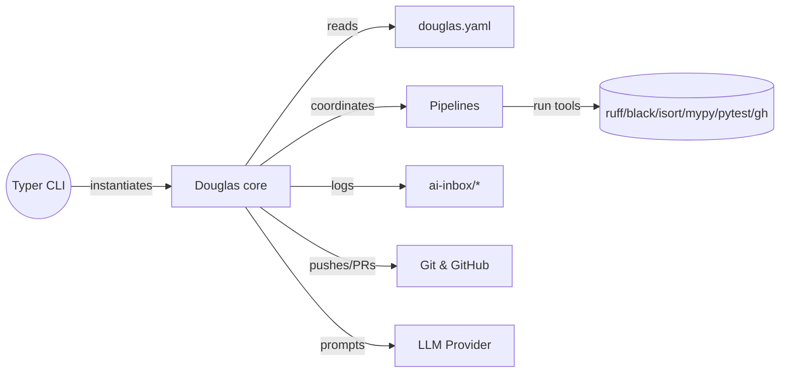
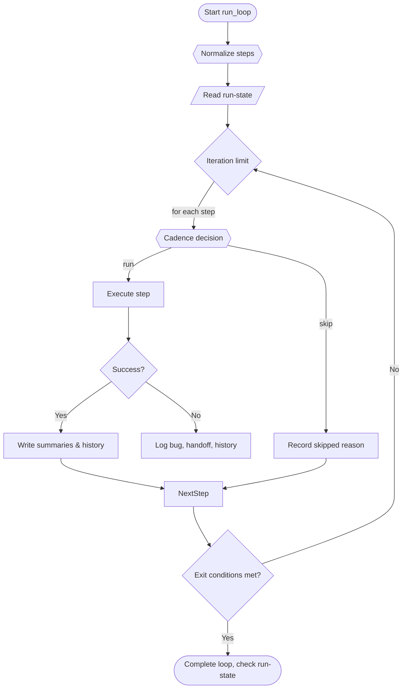

# Douglas

Douglas is a developer-lifecycle companion that automates an AI-assisted build, test, review, and release loop for software teams. It reads a configuration file, orchestrates lint/type/test/demo/retro pipelines, records outcomes for each agile role, and coordinates release policies and CI monitoring.

> **Status:** Douglas is not yet published on PyPI. Install from source as shown below. The bundled OpenAI provider talks to the OpenAI API when credentials are configured and degrades gracefully to a local stub otherwise.

## Table of contents

- [Installation & setup](#installation--setup)
- [Feature catalogue](#feature-catalogue)
  - [Configuration: `douglas.yaml`](#configuration-douglasyaml)
  - [Douglas orchestrator](#douglas-orchestrator)
  - [Cadence & sprint management](#cadence--sprint-management)
  - [Journaling, questions, and run-state controls](#journaling-questions-and-run-state-controls)
  - [Pipelines](#pipelines)
  - [Providers](#providers)
  - [Templates, bootstrapping & examples](#templates-bootstrapping--examples)
- [Application flow](#application-flow)
  - [High-level architecture](#high-level-architecture)
  - [Loop iteration life cycle](#loop-iteration-life-cycle)
  - [Artifact flow](#artifact-flow)
- [End-to-end tutorial](#end-to-end-tutorial)
- [Limitations and open gaps](#limitations-and-open-gaps)

## Installation & setup

### Install from source

```bash
# Clone the project
git clone https://github.com/dickymoore/Douglas
cd Douglas

# Create and activate a virtual environment
python -m venv .venv
source .venv/bin/activate  # Windows: .venv\Scripts\activate

# Install Douglas in editable mode with development tools
pip install -e .[dev]

# Optional: install pre-commit hooks if you plan to contribute
pre-commit install
```

With Douglas installed you can drive the orchestrator directly from the packaged Typer CLI:

```bash
# Validate your configuration and environment
douglas check

# Run the AI-assisted development loop using the default douglas.yaml
douglas run

# Scaffold a brand new project in ./my-new-service using Douglas templates
douglas init my-new-service

# Provide a custom configuration file if you keep it somewhere else
douglas run --config path/to/douglas.yaml
```

### Configure OpenAI access

Douglas ships with an OpenAI-backed provider. To enable real model output:

1. Install the OpenAI SDK (`pip install openai`) or use the optional extra (`pip install -e .[openai]`).
2. Export `OPENAI_API_KEY`. You can also set `OPENAI_MODEL` to override the default (`gpt-4o-mini`) and `OPENAI_BASE_URL`/`OPENAI_API_BASE` for compatible endpoints.

If the API key or SDK is missing, Douglas will continue to run but the provider falls back to a local stub that logs prompts instead of contacting the API.

### Running the orchestrator without installing

If you prefer not to install the package, invoke the CLI from the source tree:

```bash
python -m douglas.cli check
python -m douglas.cli run
python -m douglas.cli init sample-project
```

The commands above defer to the `Douglas` class under the hood, so you can also instantiate it directly from Python for advanced orchestration (see the [tutorial](#end-to-end-tutorial)).

## Feature catalogue

### Configuration: `douglas.yaml`

Douglas is entirely driven by a `douglas.yaml` file located at your project root. A canonical template lives in [`templates/douglas.yaml.tpl`](templates/douglas.yaml.tpl) and is used when `init_project` scaffolds a new repository. Key sections include:

- `project`: metadata used in prompts (name, description, language, license).
- `ai`: provider name, model identifier, and the path to a system prompt file used when constructing LLM prompts. [`douglas/core.py`](douglas/core.py)
- `cadence`: role/activity cadence preferences consulted by the cadence manager.[`douglas/cadence_manager.py`](douglas/cadence_manager.py)
- `loop`: ordered list of step objects (with optional per-step cadence overrides), exit conditions, and maximum iterations.[`douglas/core.py`](douglas/core.py)
- `push_policy`: governs when push/PR steps fire (`per_feature`, `per_bug`, `per_epic`, `per_sprint`).[`douglas/core.py`](douglas/core.py)
- `sprint`: high-level sprint length used to calculate per-sprint cadences.[`douglas/core.py`](douglas/core.py)
- `demo` & `retro`: configure sprint demo/retro pipelines (output formats, which sections to generate, backlog destinations). [`douglas/pipelines/demo.py`](douglas/pipelines/demo.py) [`douglas/pipelines/retro.py`](douglas/pipelines/retro.py)
- `history`: limits for preserved CI log excerpts and other retention knobs.[`douglas/core.py`](douglas/core.py)
- `paths`: customize locations for source, tests, AI inboxes, sprint folders, run-state files, and question portals.[`douglas/core.py`](douglas/core.py)
- `agents`, `run_state`, `qna`: hints for UX portals, approved run-state values, and question filename patterns used by the collaboration features. [`templates/douglas.yaml.tpl`](templates/douglas.yaml.tpl)

### Douglas orchestrator

The central `Douglas` class reads the configuration, constructs providers, and executes the AI-assisted loop.[`douglas/core.py`](douglas/core.py)

Core capabilities:

- **Lifecycle control** – `run_loop()` normalizes configured steps, enforces iteration limits, honours exit conditions (`tests_pass`, `ci_pass`, `sprint_demo_complete`, etc.), and respects soft/hard stop directives from a run-state file.[`douglas/core.py`](douglas/core.py)
- **Provider bootstrap** – `create_llm_provider()` instantiates the configured LLM provider (OpenAI with a graceful offline fallback).[`douglas/core.py`](douglas/core.py)
- **Sprint & cadence integration** – `SprintManager` tracks sprint day counters, completed features/bugs/epics, and commit counts, while `CadenceManager` decides whether each step should execute this iteration.[`douglas/core.py`](douglas/core.py)[`douglas/sprint_manager.py`](douglas/sprint_manager.py)[`douglas/cadence_manager.py`](douglas/cadence_manager.py)
- **Run-state enforcement** – `_check_run_state()` reads `user-portal/run-state.txt` (configurable) so that humans can request soft or hard stops mid-run.[`douglas/core.py`](douglas/core.py)[`douglas/controls/run_state.py`](douglas/controls/run_state.py)
- **Question handling** – `_refresh_question_state()` looks for unanswered questions in the user portal and defers role steps until blocking items have been answered and archived.[`douglas/core.py`](douglas/core.py)[`douglas/journal/questions.py`](douglas/journal/questions.py)
- **Step execution** – `_execute_step()` routes to concrete implementations for each well-known step name. Highlights:
  - `generate` builds a rich prompt (system message, project metadata, recent commits, git status, TODOs) and asks the LLM to produce diffs or code blocks. It applies results via `_apply_diff`/`_apply_code_blocks` and stages modified files.[`douglas/core.py`](douglas/core.py)
  - `review` requests LLM feedback on pending diffs and persists that feedback to `douglas_review.md` for future reference.[`douglas/core.py`](douglas/core.py)
  - `lint`, `typecheck`, `test` delegate to pipeline modules which run `ruff`/`black`/`isort`, `mypy`, and `pytest` respectively, record agent summaries, and raise blocking handoffs when failures occur.[`douglas/core.py`](douglas/core.py)[`douglas/pipelines/lint.py`](douglas/pipelines/lint.py)[`douglas/pipelines/typecheck.py`](douglas/pipelines/typecheck.py)[`douglas/pipelines/test.py`](douglas/pipelines/test.py)
  - `retro` and `demo` orchestrate the sprint retrospective and demo pack generation, writing outputs beneath `ai-inbox/sprints/<sprint>/` and `demos/<sprint>/` while logging events.[`douglas/core.py`](douglas/core.py)[`douglas/pipelines/retro.py`](douglas/pipelines/retro.py)[`douglas/pipelines/demo.py`](douglas/pipelines/demo.py)
  - `commit` autogenerates a Conventional Commit message via the LLM (with `_generate_commit_message()`), stages outstanding changes, and records the resulting commit.[`douglas/core.py`](douglas/core.py)
  - `push` performs local guard checks (configurable commands such as `black --check`), attempts `git push` with automatic fast-forward pulls, records sprint cadence consumption, and may trigger CI monitoring.[`douglas/core.py`](douglas/core.py)
  - `pr` uses the GitHub CLI to open pull requests and subsequently monitor CI runs.[`douglas/core.py`](douglas/core.py)
  - Unknown steps log a reminder but are marked executed so cadence can advance.[`douglas/core.py`](douglas/core.py)
- **Local guard checks** – `_run_local_checks()` discovers configured commands (or defaults like `black --check`, `bandit`, `semgrep` when available), runs them, and blocks release steps when they fail while writing history entries and bug tickets.[`douglas/core.py`](douglas/core.py)
- **CI monitoring** – `_monitor_ci()` polls GitHub Actions via `gh run list/view`, downloads logs, and raises handoffs/bug tickets when runs fail.[`douglas/core.py`](douglas/core.py)
- **Bug ticketing** – `_create_bug_ticket()` appends Markdown entries under `ai-inbox/bugs.md` with log excerpts and commit metadata for any failed step.[`douglas/core.py`](douglas/core.py)
- **History logging** – `write_history()` persists JSONL events in `ai-inbox/history.jsonl`, ensuring the directory is git-ignored, and most operations call `_write_history_event()` for traceability.[`douglas/core.py`](douglas/core.py)
- **Summaries & handoffs** – `_record_agent_summary()` and `_raise_agent_handoff()` write markdown summaries/handoffs for each agile role beneath `ai-inbox/sprints/<sprint>/roles/`.[`douglas/core.py`](douglas/core.py)[`douglas/journal/agent_io.py`](douglas/journal/agent_io.py)
- **Project bootstrap** – `init_project()` scaffolds a new repository (README, system prompt, `.gitignore`, sample `src/main.py`, `tests/test_main.py`, GitHub Actions workflow) using Jinja-style templates.[`douglas/core.py`](douglas/core.py)[`templates/init`](templates/init)
- **Utilities** – additional helpers fetch git status, collect TODOs, sanitize commit messages, construct PR bodies, discover run-state paths, and expose `check()`/`doctor()` diagnostics.[`douglas/core.py`](douglas/core.py)

### Cadence & sprint management

Cadence decisions ensure that each agile role participates on the right schedule:

- `CadenceManager` merges default metadata for common steps with role-level cadence overrides, returning `CadenceDecision` objects that include reasons (e.g., "per_sprint; waiting for final day").[`douglas/cadence_manager.py`](douglas/cadence_manager.py)
- `SprintManager` tracks sprint days/iterations, pending feature/bug/epic events derived from commit messages, counts how often each step has run, and enforces push/PR policies for the current sprint.[`douglas/sprint_manager.py`](douglas/sprint_manager.py)
- Together they power role-aware logging and allow exit conditions like `sprint_demo_complete` to end the loop when milestones are achieved.[`douglas/core.py`](douglas/core.py)

### Journaling, questions, and run-state controls

Douglas keeps humans in the loop via Markdown journals under `ai-inbox/`:

- `agent_io.append_summary()` and `append_handoff()` log per-role updates and blocking handoffs in sprint folders. Entries include timestamps, structured detail blocks, and handoff IDs for traceability.[`douglas/journal/agent_io.py`](douglas/journal/agent_io.py)
- `questions.raise_question()` emits YAML-front-matter Markdown files in a user portal so agents can request clarification, and `scan_for_answers()` checks for user responses. Answered questions are archived and trigger follow-up summaries.[`douglas/journal/questions.py`](douglas/journal/questions.py)
- `retro_collect.collect_role_documents()` gathers each role's summaries/handoffs when preparing the retrospective prompt.[`douglas/journal/retro_collect.py`](douglas/journal/retro_collect.py)
- `controls.run_state` defines `RunState` directives (`CONTINUE`, `SOFT_STOP`, `HARD_STOP`) that the orchestrator respects to gracefully wind down or exit immediately.[`douglas/controls/run_state.py`](douglas/controls/run_state.py)

### Pipelines

Each pipeline module focuses on a single concern:

- `pipelines.lint.run_lint()` executes `ruff`, `black --check`, and `isort --check-only`, printing clear failure diagnostics.[`douglas/pipelines/lint.py`](douglas/pipelines/lint.py)
- `pipelines.typecheck.run_typecheck()` runs `mypy` (plus any configured extras) and propagates non-zero exit codes.[`douglas/pipelines/typecheck.py`](douglas/pipelines/typecheck.py)
- `pipelines.test.run_tests()` launches `pytest -q` and returns non-zero status on failure.[`douglas/pipelines/test.py`](douglas/pipelines/test.py)
- `pipelines.demo.write_demo_pack()` renders Markdown demo decks using Jinja-style templates, enumerating commits, role highlights, how-to-run instructions, limitations, and next steps.[`douglas/pipelines/demo.py`](douglas/pipelines/demo.py)
- `pipelines.retro.run_retro()` builds a JSON prompt for the LLM from sprint journals, parses action items/wins/risks, writes per-role instruction sheets, and appends backlog entries.[`douglas/pipelines/retro.py`](douglas/pipelines/retro.py)
- `pipelines.security.run_security()` is a placeholder hook intended for future Bandit/Semgrep integrations.[`douglas/pipelines/security.py`](douglas/pipelines/security.py)

### Providers

The provider abstraction keeps Douglas model-agnostic:

- `LLMProvider` is a simple interface with a `generate_code(prompt)` method and a `create_provider()` factory.[`douglas/providers/llm_provider.py`](douglas/providers/llm_provider.py)
- `OpenAIProvider` initialises the OpenAI SDK, honours `OPENAI_MODEL`/`OPENAI_BASE_URL`, and returns real model output when `OPENAI_API_KEY` is set (falling back to a local stub if credentials or the SDK are missing).[`douglas/providers/openai_provider.py`](douglas/providers/openai_provider.py)

### Templates, bootstrapping & examples

- Template files in [`templates/init`](templates/init) drive `init_project()`, generating README/system prompts, starter code, unit tests, and GitHub Actions workflows for new repos.
- A minimal example lives under [`examples/hello-douglas`](examples/hello-douglas), showcasing the configuration needed to lint, type-check, and test a simple script.
- The project root includes `system_prompt.md`, which seeds the system message used in generated prompts.[`system_prompt.md`](system_prompt.md)

## Application flow

### High-level architecture



### Loop iteration life cycle



### Artifact flow

- Configuration + prompts → `generate`/`review` interact with the LLM and stage files.
- Each executed step writes role summaries and optional handoffs to `ai-inbox/sprints/sprint-<n>/roles/<role>/`.
- Failures create bug tickets in `ai-inbox/bugs.md` and CI logs under `ai-inbox/ci/`.
- Retro and demo steps populate `ai-inbox/sprints/` and `demos/` directories with Markdown deliverables.
- History events accumulate in `ai-inbox/history.jsonl`, providing an append-only audit trail.

## End-to-end tutorial

This walkthrough shows how to exercise Douglas on a fresh repository without depending on external APIs.

1. **Install prerequisites**
   - Python 3.9+
   - Git and GitHub CLI (`gh`) if you intend to run push/PR steps
   - Lint/type/test tooling (`ruff`, `black`, `isort`, `mypy`, `pytest`) – these are included in `.[dev]`

2. **Create and activate a virtual environment**
   ```bash
   git clone https://github.com/dickymoore/Douglas
   cd Douglas
   python -m venv .venv
   source .venv/bin/activate
   pip install -e .[dev]
   ```

3. **Prepare a sample project**
   - Create a clean directory (`mkdir demo-app && cd demo-app`).
   - Initialize git (`git init` + configure user name/email) and commit a starter file.
   - Copy `system_prompt.md` from Douglas or author your own.
   - Copy `templates/douglas.yaml.tpl` and adapt it to your repo (at minimum set the project name and ensure the `paths.app_src` and `paths.tests` entries match your layout).

4. **Configure the LLM provider**
   - Export `OPENAI_API_KEY` (and optionally `OPENAI_MODEL` or `OPENAI_BASE_URL`) to enable the bundled OpenAI integration.
   - For offline experimentation you can monkeypatch `Douglas.create_llm_provider` to return a simple object with a `generate_code(prompt)` method that prints the prompt and returns deterministic output (the test suite demonstrates this pattern). The built-in provider will also fall back to a local stub whenever credentials or the SDK are unavailable.

5. **Run the development loop from Python**
   - Because the CLI is not wired yet, run Douglas programmatically:
     ```bash
     python - <<'PY'
     from pathlib import Path
     from douglas.core import Douglas

     config_path = Path('douglas.yaml')
     doug = Douglas(config_path)
     doug.run_loop()
     PY
     ```
   - Douglas prints cadence decisions, executed step names, and exit-condition results to stdout while writing artifacts to `ai-inbox/`.

6. **Interpret the outputs**
   - Check `ai-inbox/sprints/sprint-1/roles/` for per-role summaries and handoffs.
   - Open `ai-inbox/history.jsonl` to review structured events such as commits, local check passes/failures, and CI results.
   - Examine `ai-inbox/bugs.md` when steps fail; each entry includes commit metadata and log excerpts.
   - Inspect `douglas_review.md` for the most recent AI review feedback and `demos/sprint-1/demo.md` for the generated sprint review deck.

7. **Respond to questions or control the run**
   - If Douglas raises questions (files under `user-portal/questions/`), open them in an editor, fill in the "User Answer" section, and rerun the loop—answered questions are auto-archived.
   - To request a soft stop, write `SOFT_STOP` to `user-portal/run-state.txt`; the loop will finish the sprint then exit. Use `HARD_STOP` for an immediate exit.

8. **Iterate and release**
   - Commit additional code between runs; Douglas will notice new TODOs and commits when building prompts.
   - The `push` step runs configured local checks before attempting `git push`. Ensure your repo has a remote configured (`git remote add origin ...`) if you plan to exercise push/PR steps.
   - Monitor the `ai-inbox/ci/` directory for downloaded GitHub Actions logs when CI monitoring is enabled.

9. **Bootstrap new repositories**
   - From an installed environment you can call `Douglas(...).init_project('my-new-app')` to scaffold a starter repo with templates, tests, and CI workflows. Move into the generated folder and begin iterating with the loop.

## Limitations and open gaps

- The CLI surface (`douglas` entry point) is not yet wired to the orchestrator; only a `hello` command is exposed in `cli.py`.
- `OpenAIProvider` now integrates with the OpenAI SDK (with graceful fallbacks); pluggable support for additional providers remains future work.
- The security pipeline is a stub (`run_security()` only logs a message) and the lint/typecheck modules require `subprocess` imports to function when run standalone.
- The package entry point in `pyproject.toml` (`douglas = "douglas.cli:app"`) assumes a `douglas/cli.py` module that does not yet exist; adjust before publishing to PyPI.

Despite these gaps, the core orchestration, cadence handling, journaling, retro/demo generation, and release automation logic are fully implemented and thoroughly unit tested under `tests/`.
